<!-- The banner switches automatically with the visitor's GitHub theme:
     dark theme → dark.svg  ·  light theme → light.svg -->
<picture>
  <source media="(prefers-color-scheme: dark)" srcset="dark.svg">
  
</picture>

<div align="center">

  <a href="https://t.me/TheDarkDeath788"></a>
  <a href="https://x.com/TheDarkDeath788"></a>
  <a href="https://gitlab.com/TheDarkDeath788"></a>
  <a href="https://discord.com/users/TheDarkDeath788"></a>
  <a href="https://xdaforums.com/m/thedarkdeath788.12239907"></a>

</div>

---

### `guest@sakura:~$ whoami`

**dark** · `@TDD788`

> *"crafting worlds in code and ink"*

```bash
// building multi-agent AI systems
// crafting generative art & retro worlds
```

### `$ ./stats`

<picture>
  <source media="(prefers-color-scheme: dark)" srcset="https://github-profile-summary-cards.vercel.app/api/cards/profile-details?username=TDD788&theme=tokyonight">
  
</picture>

<picture>
  <source media="(prefers-color-scheme: dark)" srcset="https://github-profile-summary-cards.vercel.app/api/cards/stats?username=TDD788&theme=tokyonight">
  
</picture>
<picture>
  <source media="(prefers-color-scheme: dark)" srcset="https://github-profile-summary-cards.vercel.app/api/cards/repos-per-language?username=TDD788&theme=tokyonight">
  
</picture>